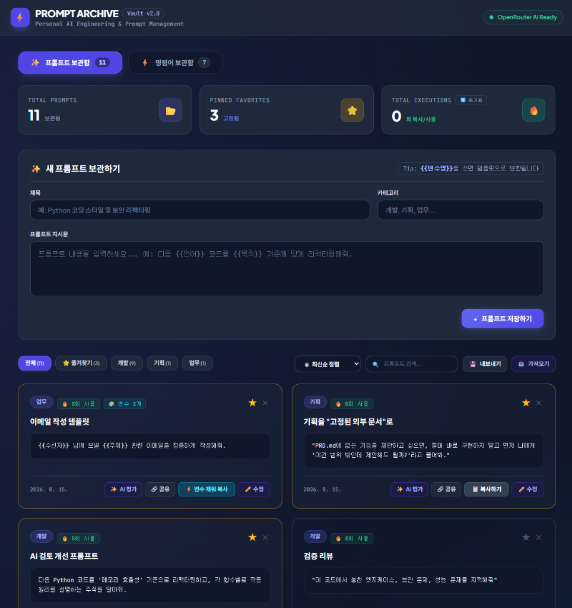
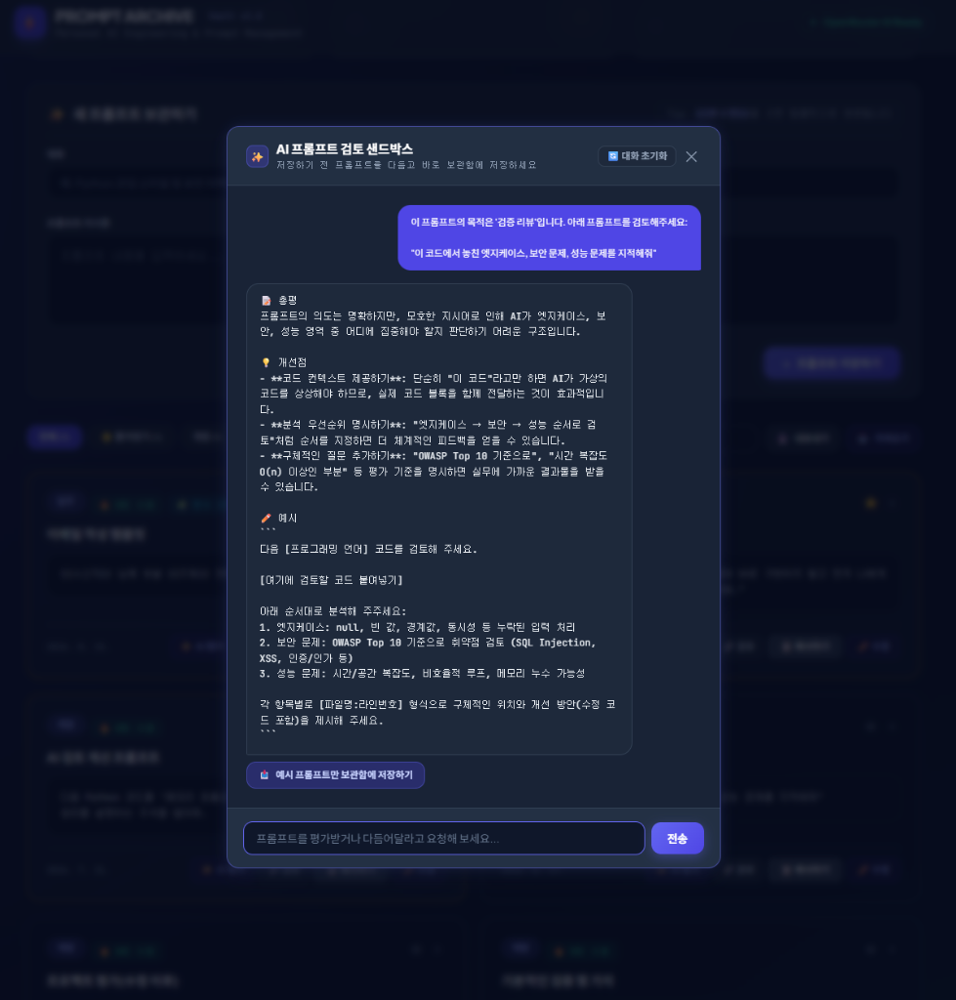
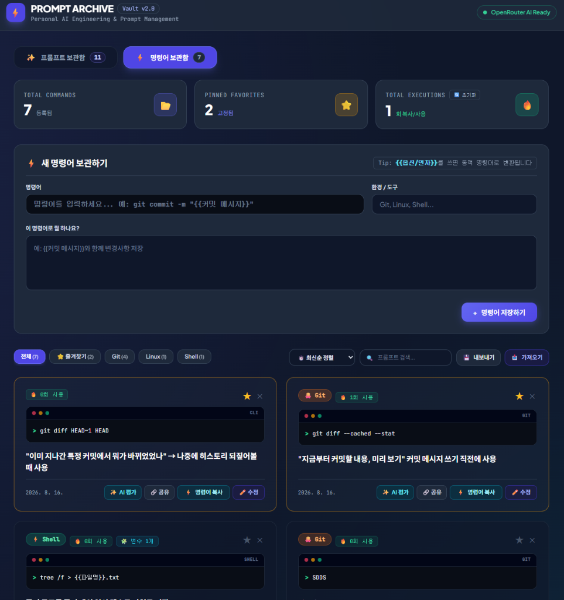
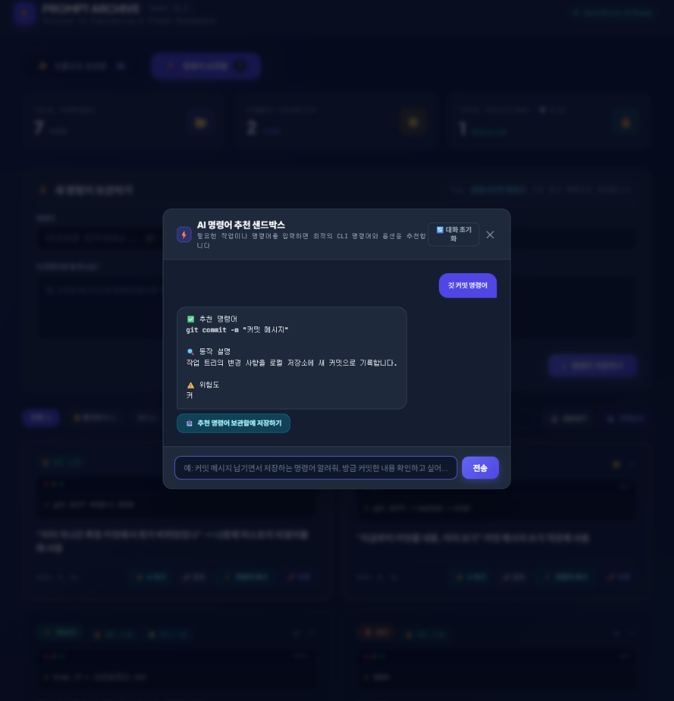

# 📦 프롬프트 & 명령어 보관함 (PromptArchive)

자주 사용하는 **AI 프롬프트**와 **개발/CLI 명령어**를 효율적으로 분류·저장하고, **동적 변수 템플릿(`{{변수}}`)** 및 **OpenRouter API 기반 실시간 AI 평가·검증 샌드박스**를 제공하는 **슬레이트 그레이 Modern Dark 듀얼 워크스페이스 웹앱**입니다.

---

## 📸 미리보기 (Preview)

### 1️⃣ 프롬프트 보관함 (Prompt Mode)
> 자주 쓰는 LLM 프롬프트를 직관적인 카드 UI로 관리하고, 동적 변수(`{{변수}}`)를 활용해 원클릭으로 채워 복사합니다.

<p align="center">
  
</p>

### 2️⃣ AI 프롬프트 검토 샌드박스 (Prompt Sandbox)
> 저장하기 전 프롬프트의 품질을 OpenRouter 실시간 AI로 평가받고, **[📝 총평 / 💡 개선점 / ✏️ 예시]** 피드백을 통해 1-Click으로 보관함에 바로 등록합니다.

<p align="center">
  
</p>

### 3️⃣ 명령어 보관함 (Command Mode)
> Docker, Git, Linux, npm, PowerShell 등 개발 CLI 명령어를 터미널 콘솔 UI로 관리하며 위험도와 동작 설명을 한눈에 파악합니다.

<p align="center">
  
</p>

### 4️⃣ AI CLI 명령어 추천 & 검증 샌드박스 (Command Sandbox)
> 필요한 작업을 자연어로 입력하면 최적의 명령어를 추천하고, **[✅ 추천 명령어 / 🔍 동작 설명 / ⚠️ 위험도]**를 정밀 분석해 안전한 실행을 돕습니다.

<p align="center">
  
</p>

---

## 🎛️ 듀얼 워크스페이스 핵심 비교

| 구분 | ✨ 프롬프트 보관함 (Prompt Mode) | ⚡ 명령어 보관함 (Command Mode) |
| :--- | :--- | :--- |
| **주요 목적** | LLM 프롬프트, 역할 정의, 템플릿 보관 | 개발 CLI 명령어, 빌드/배포 스크립트 보관 |
| **비주얼 UI** | 모던 슬레이트 카드 & 카테고리 뱃지 | 콘솔 터미널 UI (`● ● ●` 윈도우 바, `$ ` 프롬프트) |
| **지원 도구/태그** | 개발, 기획, 업무, 번역, 글쓰기 등 | `🐳 Docker`, `🐙 Git`, `⚡ Bash`, `🟦 PowerShell`, `📦 npm` 등 |
| **AI 샌드박스** | **프롬프트 품질 평가 & 리팩터링**<br>• 📝 총평 / 💡 개선점 / ✏️ 예시 | **CLI 명령어 추천 & 위험도 분석**<br>• ✅ 추천 명령어 / 🔍 동작 설명 / ⚠️ 위험도 |
| **동적 변수** | `{{언어}}`, `{{목적}}`, `{{코드}}` 등 | `{{컨테이너ID}}`, `{{브랜치명}}`, `{{옵션}}` 등 |

---

## 🌟 주요 특징 및 사용 가이드

### 1. 🧩 동적 변수 템플릿 (`{{변수명}}`) & 1초 채워 복사
- **문법**: 저장할 내용 중 가변적으로 채워 넣을 부분을 `{{변수명}}` 형태로 작성합니다.
  - *프롬프트 예시*: `"다음 {{언어}} 코드를 {{목적}} 기준에 맞춰 리팩터링해줘:\n\n{{코드}}"`
  - *명령어 예시*: `"docker logs -f --tail={{줄수}} {{컨테이너ID}}"`
- **원클릭 채워 복사**: 카드의 **`[⚡ 변수 채워 복사]`** 버튼을 누르면 입력 모달이 열리며, 변수값을 입력하는 즉시 완성된 최종 텍스트가 클립보드에 복사됩니다.

### 2. ✨ OpenRouter 연동 실시간 AI 샌드박스 & 1-Click 저장
- **양방향 연동 (보관함 ↔ AI 샌드박스)**:
  - **보관함 ➔ 샌드박스 (원클릭 AI 평가)**: 카드의 **`[✨ AI 평가]`**를 누르면 모달이 열리며 질문이 자동 주입되어 검토/추천이 즉시 시작됩니다.
  - **샌드박스 ➔ 보관함 (1-Click 저장)**: AI 응답에서 핵심 프롬프트/명령어만 정밀 추출하여 상단 등록 폼으로 1초 만에 자동 채워줍니다.
- **스트리밍 & 스마트 자동 페일오버(Failover)**:
  - Server-Sent Events(SSE) 실시간 스트리밍으로 타이핑 효과 지원
  - 백엔드 실시간 노이즈 필터링(Zero-Leakage)으로 불필요한 생각 과정 없이 정제된 한국어 3단 응답 제공
  - 1순위 AI 모델 응답 지연/오류 발생 시 2순위, 3순위 무료 모델로 중단 없이 자동 전환

### 3. ⭐ 즐겨찾기(Pin) & 실시간 검색 / 정렬
- **상단 고정(Pin)**: 카드 우측 상단의 **⭐️ 별 아이콘**을 누르면 항상 최상단에 고정됩니다.
- **실시간 검색**: 제목, 카테고리, 본문 내용이 타이핑과 동시에 초고속 필터링됩니다.
- **정렬 옵션**: **[⏱️ 최신순 / 🔥 자주 쓴 순 / 🔤 이름순]** 정렬을 지원합니다.

### 4. 🔥 사용 횟수 자동 누적 & 통계 초기화
- 복사(`[📋 복사]` 또는 `[⚡ 변수 채워 복사]`)할 때마다 사용 횟수가 자동 누적되어 `🔥 X회 사용` 뱃지가 표시됩니다.
- 대시보드의 **`TOTAL EXECUTIONS`** 통계 카드 내 **`[🔄 초기화]`** 버튼으로 카운트만 안전하게 0으로 리셋할 수 있습니다.

### 5. 💾 스마트 데이터 백업(내보내기) & 4대 정책 가져오기(병합)
- **`[💾 내보내기]`**: `promptarchive_backup_YYYY-MM-DD.json` 파일로 전체 데이터를 1초 만에 백업합니다.
- **`[📥 가져오기]`**: JSON 파일을 불러올 때 4가지 충돌 처리 정책을 선택할 수 있습니다:
  1. **스마트 병합 (추천)**: 기존 데이터 유지 + 중복 ID 갱신 + 신규 항목 추가
  2. **안전 병합 (새 ID)**: 모든 항목에 새 ID를 부여하여 중복 없이 전체 추가
  3. **중복 건너뛰기 (스킵)**: 기존에 없는 신규 항목만 추가
  4. **전체 덮어쓰기**: 기존 데이터를 지우고 파일 데이터로 100% 교체

### 6. 🔗 카드별 단일 JSON 공유
- 카드의 **`[🔗 공유]`** 버튼을 누르면 제목, 카테고리, 본문이 담긴 단일 JSON 객체가 복사되어 동료나 다른 기기에 손쉽게 전달할 수 있습니다.

---

## 🚀 빠른 시작 가이드 (Getting Started)

### 1. 패키지 설치
```bash
npm install
```

### 2. `.env` 환경 변수 설정
`.env.example` 파일을 복사하여 `.env`를 생성하고 OpenRouter API 키를 입력합니다.
```env
OPENROUTER_API_KEY=your_openrouter_api_key_here
PORT=3000
```
> 🔑 OpenRouter API 키 무료 발급: https://openrouter.ai/settings/keys

### 3. 프로그램 실행
* **Windows 간편 실행**: `start.bat` 더블클릭
  - 포트 점검 ➔ 백그라운드 서버 실행 ➔ 브라우저 자동 오픈(`http://localhost:3000`)
  - 브라우저를 닫으면 하트비트 감지로 서버가 자동 종료됩니다.
* **터미널 수동 실행**:
```bash
npm start
```

---

## 📁 프로젝트 폴더 구조

```text
PromptArchive/
├── config/
│   ├── models.json              # AI 모델 우선순위 목록 (Failover 체인)
│   ├── systemPrompt.txt         # 프롬프트 보관함용 AI 평가 프롬프트
│   └── commandSystemPrompt.txt  # 명령어 보관함용 CLI 검증 프롬프트
├── docs/
│   └── assets/                  # README 및 깃허브용 UI 스크린샷 이미지
├── logs/
│   └── eval-usage.log           # AI 호출 및 토큰 사용량 메타데이터 로그 (Git 제외)
├── index.html                   # 프론트엔드 UI/UX (TailwindCSS + Vanilla JS)
├── server.js                    # Express 백엔드 (SSE 스트리밍 & OpenRouter API 연동)
├── start.bat                    # Windows 원클릭 실행 & 포트 자동 정리 배치 스크립트
├── package.json                 # Node.js 프로젝트 설정 및 의존성
├── .env.example                 # 환경 변수 템플릿
├── .gitignore                   # Git 버전 관리 제외 목록
├── AGENTS.md                    # AI 에이전트 공통 가이드라인 & 개발/보안 규칙
├── CLAUDE.md                    # Claude Code 환경 전용 가이드
├── GEMINI.md                    # Gemini / Antigravity 환경 전용 가이드
└── README.md                    # 프로젝트 안내 문서
```

---

## ⚙️ 고급 설정 (Configuration)

### 1. AI 모델 우선순위 및 다단계 페일오버(Failover) 설정 (`config/models.json`)

OpenRouter의 **무료 모델(`:free`)**은 제공사 사정이나 트래픽 과부하에 따라 언제든 일시 중단·삭제되거나 새로운 모델로 교체될 수 있습니다. PromptArchive는 이러한 무료 API 환경에서도 안정적인 서비스를 보장하기 위해 **다단계 자동 페일오버(Failover) 체인**을 탑재하고 있습니다.

* **동작 원리**:
  1. `config/models.json`에 정의된 **맨 위(1순위) 모델**부터 가장 먼저 AI 호출을 시도합니다.
  2. 1순위 모델이 Rate Limit(호출 한도 초과), 서버 에러, 응답 지연(타임아웃) 등으로 실패하면 **중단 없이 즉시 2순위 모델로 자동 전환**됩니다.
  3. 2순위 모델마저 실패할 경우 **3순위 모델로 순차 페일오버**되어 끝까지 답변을 받아냅니다.
* **설정 커스텀**:
  원하는 OpenRouter 모델(최신 무료 모델 또는 고성능 유료 모델)의 ID를 위에서부터 선호하는 우선순위대로 최대 3개(또는 그 이상) 자유롭게 배치하여 사용할 수 있습니다.

```json
[
  "z-ai/glm-5.2:free",
  "minimax/minimax-m3:free",
  "nvidia/nemotron-3.5-lightning:free",
  "google/gemma-4-31b-it:free",
  "google/gemma-4-26b-a4b-it:free"
]
```

### 2. AI 검토 규칙 수정 (`config/*.txt`)
- **프롬프트 보관함**: `config/systemPrompt.txt` (Max Tokens: 800)
- **명령어 보관함**: `config/commandSystemPrompt.txt` (Max Tokens: 800)

---

## 🔒 개인정보 및 보안 (Security)

- **로컬 스토리지 격리**: 사용자가 입력한 모든 프롬프트/명령어는 브라우저 내부 `localStorage`에만 보관되며, 서버나 외부로 전송/저장되지 않습니다.
- **토큰 로그 익명화**: `logs/eval-usage.log`에는 프롬프트 원문이 일절 기록되지 않고 토큰 수치와 모델 메타데이터만 남습니다.
- **API 키 보호**: OpenRouter API 키는 서버 환경변수(`.env`)로만 관리되며 클라이언트 코드에 절대 노출되지 않습니다.


